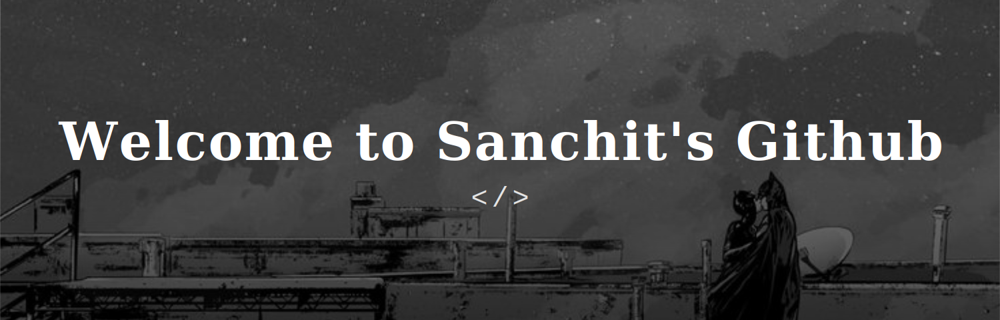
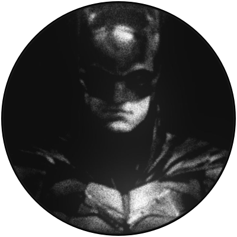

<!-- Banner -->

  

<h2 align="center">🔗 Connect Me</h2>

<!-- Connect -->

  
  
  
  
  

 

<!-- About Me -->
<h2 align="center">🦇 About Me</h2>

### Hey there! I'm Sanchit

A **B.Tech AI & ML** undergrad running on **Diet Coke** and a healthy obsession with minimalist dark themes. The day is for survival. The night is when things actually happen: the gym, the IDE, and one more episode I definitely shouldn't be starting at 2 AM. Code is my second language. Caffeine is my first.

🌙&nbsp; Pretty much nocturnal. Best commits ship after midnight. 
🏋️&nbsp; Gym, code, repeat. 
📺&nbsp; Will absolutely finish a show in one sitting. 
😴&nbsp; Sleep is a feature I haven't shipped yet.

 

 

<!-- Technologies -->
<h2 align="center">⚙️ Technologies</h2>

  
  
  
  
  
  
  
  
  

 

<!-- Statistics -->
<h2 align="center">📊 Statistics</h2>

  
  &nbsp;&nbsp;&nbsp;&nbsp;&nbsp;&nbsp;
  

  <i>thanks for stopping by the batcave 🦇</i>

  · · ·

